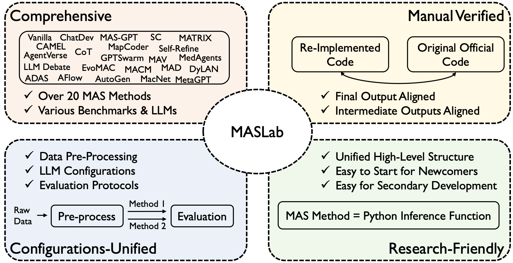

# MASLab: A Unified and Comprehensive Codebase for LLM-based Multi-Agent Systems



## Key Features
- **Comprehensive:** MASLab integrates over 20 LLM-based MAS methods (since March 2023)
- **Unified:** MASLab unified data pre-processing and evaluation protocols to ensure fair comparisons.
- **Research-Friendly:** MASLab implements methods within a shared streamlined structure.

## News
- [20250523] Release the preprint version! See the [ArXiv](https://arxiv.org/pdf/2505.16988).
- [20250420] Release the initial version! See the initial manuscript [here](./assets/MASLab_github.pdf).

## Get Started

1. Specify your model configs in `./model_api_configs/model_api_config.json`:
```
"gpt-4o-mini-2024-07-18": {
        "model_list": [
            {"model_name": "gpt-4o-mini-2024-07-18", "model_url": "http://a.b.c.d:e/v1", "api_key": "xyz"}
        ],
        "max_workers_per_model": 10
    }
```

2. To see if the codebase is executable (e.g., vanilla, cot, agentverse)
```
python inference.py --method_name <method_name> --debug
```

3. To inference on a dataset
```
# Step 1: build the test dataset
python datasets/build_test_dataset.py --dataset_name <dataset_name>

# Step 2 (Sequential): Inference on the whole dataset
python inference.py --method_name <method_name> --test_dataset_name <dataset_name> --sequential

# Or Step 2 (Parallel): Inference on the whole dataset
python inference.py --method_name <method_name> --test_dataset_name <dataset_name>
```

## Citation
```
@article{ye2025maslab,
  title={MASLab: A Unified and Comprehensive Codebase for LLM-based Multi-Agent Systems},
  author={Ye, Rui and Huang, Keduan and Wu, Qimin and Cai, Yuzhu and Jin, Tian and Pang, Xianghe and Liu, Xiangrui and Su, Jiaqi and Qian, Chen and Tang, Bohan and others},
  journal={arXiv preprint arXiv:2505.16988},
  year={2025}
}
```
